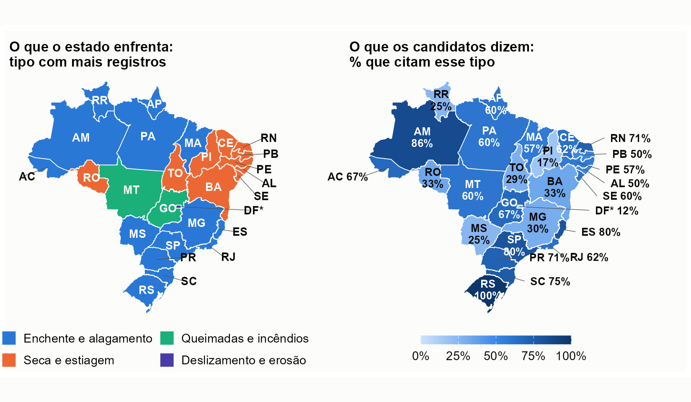

# Risco e desastre nos planos de governo dos candidatos a governador (2026)

Relatório descritivo e público sobre **o que os candidatos a governador dizem, e deixam de dizer, sobre risco e desastre** nos planos de governo registrados no TSE para as eleições de 2026. A leitura dos planos combina um **dicionário de termos** com **modelos de linguagem locais** e regras textuais, por meio do pacote [**acR**](https://github.com/andersonheri/acR).

**Autor:** Anderson Henrique · Doutor em Ciência Política (UFPE) · pós-doutorado no CEM/USP (apoio FAPESP) · pesquisador colaborador do Ipea · INCT QualiGov · [ORCID 0000-0002-1842-2725](https://orcid.org/0000-0002-1842-2725) · andersonheri@gmail.com
**Coleta congelada em:** 23/09/2026 (o TSE atualiza os arquivos várias vezes ao dia)

---

## O que o relatório responde

| Pergunta | Onde |
|---|---|
| Quantos candidatos abordam o tema e com que concretude? | Seções 3 a 5 |
| Quais fases do ciclo e quais tipos de desastre aparecem? | Seção 4 |
| Falar de clima é falar de desastre? | Seção 6 |
| **Quem fala e como fala?** (casos, trechos, balanço x proposta x crítica) | Seção 7 |
| Muda por região, estado, partido e campo político? | Seções 8 e 10 |
| O plano fala do desastre que o estado de fato sofre? | Seção 9 |
| Os modelos são confiáveis? | Seção 12 |

## Principais resultados (universo: 172 candidatos deferidos, com plano)

- **74,4%** (128) mencionam risco ou desastre; **41** não têm nenhuma menção.
- **34,9%** (60) têm ação concreta em metade ou mais das passagens sobre o tema; só **2,3%** (4) associam a ação a meta, prazo, indicador ou orçamento.
- Os planos **antecipam mais do que respondem**: prevenção e preparação em 71,5% dos candidatos, resposta em 34,9% e recuperação em 24,4%.
- **Descompasso territorial:** no Piauí, a seca é 92% dos registros de desastre, mas só 17% dos candidatos a citam. Não há relação entre a intensidade de desastres do estado e a concretude dos planos (Spearman ≈ 0).
- **Confiabilidade entre os dois modelos:** boa para tipos de ameaça, aceitável para relevância (alfa de Krippendorff = 0,78) e **fraca para especificidade (0,58)**, que deve ser lida como estimativa aproximada.




## Método em uma página

1. **Coleta** (TSE, dados abertos): cadastro, situação da candidatura e planos em PDF; universo = deferidos com plano. PDFs escaneados passam por OCR (Tesseract).
2. **Janelas:** o dicionário seleciona frases com termos de risco e desastre; cada uma, com a anterior e a seguinte, forma uma *janela*. A frase com o termo é a *frase focal*.
3. **Codebook (5 dimensões):** relevância, fase do ciclo, tipo de ameaça, especificidade (0 a 4) e ancoragem (por regras).
4. **Classificação:** `gpt-oss-20b` (todas as janelas) e `gemma-4-26b` (relevância em todas; demais dimensões em 30% das relevantes), rodando localmente no LM Studio.
5. **Perfil do candidato** em cinco degraus. "Ação concreta" = metade ou mais das passagens com nível ≥ 3.
6. **Revisão manual** das 14 passagens de nível 4 (`config/revisao_manual.csv`): 8 mantidas, 6 rebaixadas.
7. **Confiabilidade:** concordância entre modelos (acordo, kappa, alfa de Krippendorff, AC1 de Gwet).
8. **Cruzamentos:** região, UF, partido e campo (Bolognesi, Ribeiro e Codato, 2023), incumbência e exposição a desastres (Atlas Digital de Desastres, MIDR/S2iD, 2013 a 2025).

## Estrutura do projeto

```
Candidatos_gov/
├── Candidatos_gov.Rproj            # abrir este arquivo no RStudio
├── run_all.R                       # roda o pipeline completo, na ordem (download e LLM desligados por padrão)
├── _quarto.yml                     # projeto Quarto (renderiza o relatório)
├── R/
│   ├── 00_setup.R                  # pacotes, caminhos, parâmetros do estudo e formatadores
│   ├── 01_baixar_dados.R           # baixa candidatos e os 27 ZIPs de planos do TSE; grava manifesto com sha256
│   ├── 02_base_candidatos.R        # monta a base de governadores (cadastro + situação) e o índice de PDFs
│   ├── 03_extrair_texto.R          # extrai o texto dos PDFs (pdftotext) e consolida um texto por candidato
│   ├── 03b_ocr_escaneados.R        # OCR (Tesseract) dos planos escaneados
│   ├── 04_trechos_dicionario.R     # aplica o dicionário de risco e desastre (presença e densidade)
│   ├── 04b_janelas.R               # monta as janelas (frase do termo ± 1 frase) e marca a frase focal
│   ├── 05_codebooks.R              # codebooks do acR (relevância, fase, ameaça, especificidade, ancoragem)
│   ├── 06_classificar_llm.R        # classificação com ac_qual_code() e modelo local (LM Studio); retomável
│   ├── 07_ancoragem_regras.R       # órgão, orçamento, meta, prazo e indicador por regras textuais
│   ├── 08_consolidar.R             # consolida rótulos, mede a concordância entre modelos, gera indicadores
│   ├── 09_analises.R               # base analítica por candidato e tabelas do relatório (t01 a t12)
│   ├── 10_figuras.R                # figuras de perfil, fases, ameaças, concretude, ancoragem e mapa por UF
│   ├── 11_exposicao.R              # exposição histórica a desastres por UF (Atlas/S2iD) x tipos citados
│   ├── 12_figuras_exposicao.R      # figuras da seção de exposição (heatmaps, ranking, registros por ano)
│   ├── 13_quem_fala.R              # destaques, verbos no passado e anexo dos 172 candidatos
│   ├── 14_figuras_mapas.R          # mapa do descompasso e cruzamento exposição x concretude (quadrantes)
│   ├── 15_extras.R                 # impressão digital dos planos, quem não cita o desastre do estado, expressões por campo
│   ├── dicionario.R                # dicionário de termos de risco e desastre
│   └── tema_graficos.R             # tema e paletas dos gráficos
├── config/
│   ├── partidos_campos.csv         # classificação dos partidos (Bolognesi et al., 2023, e do autor)
│   ├── municipios_por_uf.csv       # número de municípios por UF
│   ├── revisao_manual.csv          # as 14 passagens de nível 4 lidas uma a uma
│   ├── codebook_exemplos.csv       # definição e exemplo real de cada categoria do codebook
│   ├── casos_emblematicos.csv      # trechos dos planos citados nos quadros de "quem fala"
│   └── valores_reais.csv           # valores em reais nas passagens de risco, classificados (promessa, balanço, dano...)
├── data/
│   ├── raw/                        # dados brutos do TSE e do Atlas (NÃO versionado; baixar com o script 01)
│   └── processed/                  # arquivos pequenos necessários ao relatório (o resto NÃO versionado)
├── outputs/
│   ├── tables/                     # tabelas finais e rótulos consolidados (versionados, pequenos)
│   └── figures/                    # figuras em PNG usadas no relatório (versionadas)
└── relatorios/
    ├── relatorio_final.qmd         # relatório em Quarto (HTML e PDF)
    ├── estilo.css                  # estilo do HTML (título em cima, fonte embaixo, tabelas com linhas)
    ├── _identificacao.tex          # página de identificação do PDF
    └── renderizar.bat              # gera HTML e PDF (Windows)
```

## Como reproduzir

Requisitos: R 4.6, [Quarto](https://quarto.org), LaTeX (para o PDF) e, só para refazer a classificação, o [LM Studio](https://lmstudio.ai) com os dois modelos carregados.

```r
# pacotes principais
install.packages(c("here", "data.table", "dplyr", "stringr", "purrr", "ggplot2",
                   "patchwork", "geobr", "sf", "irr", "knitr", "rmarkdown"))
install.packages("acR")   # disponível no CRAN (versão de desenvolvimento: remotes::install_github("andersonheri/acR"))
```

- **Só o relatório** (usa os arquivos já incluídos em `outputs/` e `data/processed/`): `quarto render relatorios/relatorio_final.qmd` (ou `relatorios/renderizar.bat`, no Windows).
- **Pipeline sem download nem LLM:** abrir o `.Rproj` e rodar `source("run_all.R")`.
- **Pipeline completo:** `RODAR_DOWNLOAD=1 RODAR_LLM=1 RENDERIZAR=1` antes de rodar `run_all.R`. O download baixa cerca de 400 MB (TSE e Atlas Digital de Desastres), e a classificação exige o LM Studio em `localhost:1234` e leva horas. Cada arquivo baixado tem `sha256` registrado no manifesto da coleta.

## Limitações que importam

- A classificação **não foi validada por codificação humana**; mede-se a consistência entre modelos, não o acerto.
- O codebook mede o que a frase diz sobre risco e desastre, mas **não distingue proposta, balanço e crítica**; isso pesa nos governadores em exercício.
- Ausência de menção não significa omissão deliberada, e o tamanho do plano (de centenas a dezenas de milhares de palavras) explica boa parte da presença do tema.
- Poucos candidatos por UF (4 a 10) e por partido: leia os percentuais como retrato, não como tendência.

## Uso de inteligência artificial

Usamos inteligência artificial de duas formas, com funções e limites distintos.

**Como instrumento de medida.** Dois modelos de linguagem de código aberto, executados localmente, no computador do autor, por meio do LM Studio, aplicaram o codebook às passagens dos planos: o `gpt-oss-20b` (OpenAI) e o `gemma-4-26b` (Google), com o pacote [acR](https://github.com/andersonheri/acR). O primeiro classificou todas as passagens e sustenta o cenário principal; o segundo classificou a relevância de todas e as demais dimensões em uma amostra aleatória de 30% das relevantes. Na classificação, nenhum texto dos planos foi enviado a serviços externos. Os PDFs escaneados foram lidos com o Tesseract (OCR), que não é um modelo generativo. Os limites dessa medida, que é consistente entre modelos, mas não foi validada por codificação humana, estão descritos no relatório.

**Como assistente de trabalho.** O modelo Claude (Anthropic), usado por meio do Claude Code, apoiou a escrita e a depuração dos scripts em R, a montagem do documento em Quarto (tabelas, quadros, figuras e formatação), a busca de trechos nos dados para exemplificar as categorias e a redação de versões preliminares de parágrafos. Esse apoio não incluiu a análise dos planos nem a decisão sobre o que os números significam.

**O que ficou com o autor.** O julgamento e a autoria são do autor, que formulou a pergunta de pesquisa e o desenho do estudo, definiu o codebook, as regras de decisão e a fusão de categorias, classificou os partidos que não constam do artigo de referência, leu e revisou manualmente, uma a uma, as passagens de nível 4, escolheu os casos e os trechos citados, conferiu os números e as referências e responde pela interpretação e pelo texto final. As sugestões do assistente foram lidas, corrigidas ou recusadas nesse processo, e o uso de inteligência artificial não substitui a responsabilidade do autor pelo conteúdo.

## Como citar

HENRIQUE, A. *Risco e desastre nos planos de governo dos candidatos a governador (2026)*. Relatório descritivo. 2026. Repositório: <https://github.com/andersonheri/planos-governo-risco-desastre-2026>.
