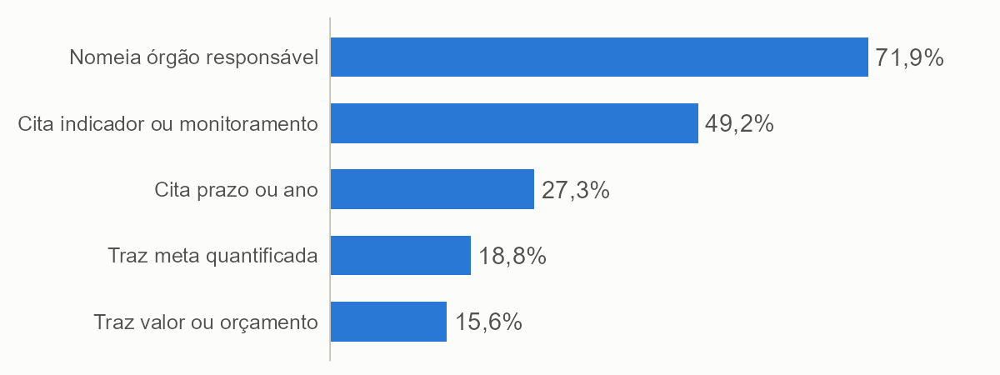

Doutor em Ciência Política pela Universidade Federal de Pernambuco (UFPE, 2025). Pesquisador de pós-doutorado no Centro de Estudos da Metrópole (CEM/USP), com apoio da Fapesp. Pesquisador colaborador no Instituto de Pesquisa Econômica Aplicada (Ipea) e pesquisador no Instituto Nacional de Ciência e Tecnologia QualiGov (INCT QualiGov).

Este relatório foi conduzido de forma independente pelo autor, com o objetivo de responder à seguinte pergunta de pesquisa: **o que os candidatos a governador dizem, e deixam de dizer, sobre risco e desastre em seus planos de governo?**

Para respondê-la, o relatório mede quantos candidatos abordam o tema, quais fases do ciclo de gestão de risco e quais tipos de desastre aparecem e com que grau de concretude; compara regiões, estados, partidos e campos políticos; distingue o discurso sobre agenda climática geral do discurso sobre risco e desastre; mostra **quem fala e como fala**, por meio de trechos dos próprios planos; e cruza o que os planos citam com o histórico de desastres de cada estado. O relatório persegue três contribuições. A primeira é um **retrato nacional** do que os 172 candidatos a governador dizem sobre risco e desastre antes da eleição, com casos e trechos que permitem ao leitor ver o material, e não só os indicadores. A segunda é a distinção entre **falar e prometer**, por meio de uma escala de concretude, de elementos de ancoragem (órgão, meta, prazo, indicador e orçamento) e da separação, por revisão manual, entre proposta, balanço e crítica. A terceira é um **método replicável**, em que a leitura dos planos é feita por modelos de linguagem de código aberto executados localmente, com medida explícita de confiabilidade e com código e dados derivados abertos.

Este documento resume os achados principais. Para a leitura completa — incluindo casos individuais, tabelas por UF e por partido, o codebook integral, os testes estatísticos e a discussão das limitações — ver o **relatório completo**, disponível em repositório aberto junto com o código e os dados derivados: [github.com/andersonheri/planos-governo-risco-desastre-2026](https://github.com/andersonheri/planos-governo-risco-desastre-2026).

## Dimensões conceituais e revisão da literatura

A literatura oferece ao menos três razões para olhar para esse material. A primeira é conceitual: desde os trabalhos de Quarantelli (1998) e Wisner et al. (2004), e mais recentemente Kelman (2020), entende-se que o desastre não é o evento físico em si, mas o resultado de um evento perigoso que encontra populações expostas e vulneráveis, e que a vulnerabilidade tem história, distribuição social e território (Cutter, 1996; 2011). O glossário do Escritório das Nações Unidas para Redução do Risco de Desastres (UNDRR, 2024) e o Marco de Sendai (UNDRR, 2015) traduzem essa visão em uma agenda que começa por entender o risco, passa pela governança e pelo investimento em redução de risco e chega à preparação e à reconstrução. No Brasil, essa perspectiva foi desenvolvida sobretudo pela sociologia dos desastres (Valencio, 2009; Marchezini et al., 2017) e dialoga com a leitura de Beck (2010) sobre a sociedade de risco. Um plano que fala de risco apenas como "evento climático" e um plano que fala de exposição, vulnerabilidade e prevenção estão, portanto, dizendo coisas diferentes, e o codebook usado tenta separar essas camadas.

A segunda razão é política: há evidência de que os eleitores premiam o alívio depois do desastre mais do que o investimento em prevenção (Healy e Malhotra, 2009), de que o desastre funciona como evento focalizador que abre janelas para mudança de política (Birkland, 1998; 2006), e de que a distribuição de declarações e de recursos de emergência responde a incentivos eleitorais e partidários (Reeves, 2011; Henrique e Batista, 2020). Se essas lógicas valem, é razoável esperar que os candidatos falem mais de resposta e de reconstrução do que de prevenção, e que falem mais depois do que antes de eventos marcantes.

A terceira razão é a comunicação: Ewart, McLean e Ames (2016) discutem como os políticos deveriam falar antes, durante e depois dos desastres, e a literatura de gestão de crise trata a liderança pública como uma função central da resposta (Boin et al., 2005). Estudos de política de desastres tendem a se concentrar no que os governos fazem depois do evento (Sylves, 2019; Handmer e Dovers, 2007); o que os candidatos prometem antes de governar recebe menos atenção, e o plano de governo é o documento público em que essa promessa fica registrada.

Essa base conceitual orientou a escolha das dimensões do codebook — relevância, fase do ciclo de gestão de risco, tipo de ameaça, especificidade e ancoragem — e a decisão de tratar agenda climática geral e risco de desastre como categorias distintas, ainda que relacionadas.

## Construção do codebook e classificação dos planos

A unidade de análise é a *janela*: a frase que contém um termo de um dicionário de risco e desastre, mais a frase anterior e a seguinte, com a frase focal marcada para o modelo. O codebook (versão 0.9) define cinco dimensões. A **relevância** separa o que trata de risco e desastre do que trata de agenda climática geral ou de outro assunto, por uma regra de decisão em ordem. A **fase do ciclo** marca prevenção e preparação (uma só categoria), resposta, recuperação e adaptação climática explícita, com uma regra específica para benefício habitacional — moradia temporária conta como resposta, e aluguel social com horizonte de transição, moradia definitiva e reconstrução contam como recuperação. O **tipo de ameaça** cobre nove categorias, de enchente a acidentes tecnológicos, mais "desastres em geral" para menções sem tipo nomeado. A **especificidade** mede o grau de concretude em uma escala de 0 a 4, do slogan à ação com meta, prazo, indicador ou orçamento. A **ancoragem** identifica, por regras textuais, os elementos que permitem cobrar uma promessa — órgão, orçamento, meta, prazo e indicador.

As passagens de nível 4 — as que sustentam o degrau mais alto do perfil do candidato — foram revisadas manualmente, uma a uma, para separar proposta de balanço e de crítica ao governo em exercício, porque o codebook mede o que a frase focal diz sobre risco e desastre, mas não distingue, por si só, se ela propõe, relata o que já foi feito ou critica a gestão anterior.

## Metodologia

**Universo e fontes.** O universo são os candidatos a governador com candidatura deferida e plano de governo registrado no Portal de Dados Abertos do TSE (coleta congelada em 23/09/2026), num total de 172 candidatos. Os dados de exposição a desastres vêm do Atlas Digital de Desastres no Brasil (MIDR/S2iD), com registros de 2013 a 2025. A classificação ideológica dos partidos segue Bolognesi, Ribeiro e Codato (2023), agregada em cinco campos políticos; partidos criados ou fundidos depois da pesquisa que fundamenta o artigo foram classificados pelo autor.

**Classificadores.** A leitura dos planos foi feita por dois modelos de linguagem de código aberto, executados localmente no computador do autor por meio do LM Studio — o `gpt-oss-20b` (OpenAI) e o `gemma-4-26b` (Google) —, com o pacote **acR**, desenvolvido pelo autor e também aberto (Henrique, 2026). Nenhum texto dos planos foi enviado a serviços externos. O `gpt-oss` classificou todas as janelas e sustenta o cenário principal; o `gemma` classificou a relevância de todas e as demais dimensões em uma amostra aleatória de 30% das janelas relevantes, o que reduziu o tempo de processamento de cerca de 40 para 17 horas.

**Cenários e confiabilidade.** Como os dois modelos podem discordar em casos de fronteira, os resultados são apresentados em três cenários: o **principal** (`gpt-oss`), o **conservador** (o que os dois modelos concordam ser relevante) e o **amplo** (o que ao menos um considera). A confiabilidade é medida pela concordância entre os dois modelos, e não por acerto contra uma codificação humana de referência, pelo alfa de Krippendorff (Krippendorff, 2018), reportado por variável: a concordância é boa para os tipos de ameaça específicos, aceitável para a relevância e fraca para a especificidade, o que recomenda ler o degrau de ação concreta como estimativa aproximada, e não como contagem exata.

**Controle pela extensão do plano.** A extensão do plano é tratada como variável de confusão, porque planos mais longos têm mais chance de mencionar qualquer tema. Comparações entre campos políticos e categorias usam controle por `log(palavras)` em regressão logística, e um limiar de 2.000 palavras, testado por sensibilidade em 1.000 e 3.000 palavras, sinaliza planos curtos em todas as tabelas e figuras.

**Replicabilidade.** O código (em R), o codebook, os dados derivados, as tabelas, as figuras e este relatório estão em repositório público, para que qualquer pessoa possa refazer a coleta, a classificação e as análises: [github.com/andersonheri/planos-governo-risco-desastre-2026](https://github.com/andersonheri/planos-governo-risco-desastre-2026). Cada arquivo baixado do TSE tem seu `sha256` registrado no manifesto da coleta.

## Resultados e Discussão

**Quase todos citam o tema, poucos o tornam verificável.** Dos 172 candidatos, 128 (74,4%) mencionam risco ou desastre em algum ponto do plano, mas só 60 (34,9%) têm ação concreta em metade ou mais das passagens sobre o tema, e apenas 4 associam essa ação a meta, prazo, indicador ou orçamento.

{#fig-perfil width=95%}

Entre os elementos que permitem cobrar uma promessa, o órgão responsável é o mais citado (71,9% dos que mencionam o tema), seguido de indicador ou monitoramento (49,2%); prazo (27,3%), meta quantificada (18,8%) e valor ou orçamento (15,6%) são bem mais raros. Como a detecção é feita por regras textuais e só considera a frase que contém o termo de risco, os percentuais são conservadores. Só três candidatos — Tarcísio (Republicanos-SP), Carlos Machado (PCB-SP) e Ben Mendes (Missão-MG) — trazem valor em reais associado a uma promessa específica de risco e desastre.

{#fig-ancoragem width=90%}

**Os planos olham para antes do desastre.** Prevenção e preparação aparecem em 71,5% dos candidatos, contra 34,9% de resposta e 24,4% de recuperação, e só 27 candidatos (15,7%) cobrem as três fases do ciclo. O padrão contraria a expectativa, derivada de Healy e Malhotra (2009), de que o incentivo eleitoral favoreceria o discurso sobre o socorro e a reconstrução. Uma leitura possível é que o plano de governo é um documento programático, e não uma peça de campanha de rua; outra é que a divisão federativa de competências atribui ao estado sobretudo a coordenação territorial e as obras estruturais, enquanto resposta imediata e reconstrução recaem em boa parte sobre municípios e União — o que tornaria a ênfase em prevenção reflexo também do papel constitucional do governador, e não só de escolha discursiva.

**A presença do tema depende do tamanho do plano, e em parte do campo político.** A presença vai de 35% nos planos com menos de 5 mil palavras a 100% nos de mais de 20 mil. Na extrema-esquerda, 51% dos candidatos mencionam o tema, contra 82% na direita, 91% na extrema-direita e 100% na esquerda e centro-esquerda. Controlando pelo tamanho do plano por regressão logística, a diferença da extrema-esquerda para a direita diminui (razão de chances de 0,78 sem controle para 0,30 com controle) mas não desaparece, e é heterogênea entre os partidos da categoria — PSTU e PSOL estão no patamar da direita, enquanto PCO, UP e PCB puxam a média para baixo. Na concretude, não se detecta diferença entre campos: o que varia é **se** o tema aparece, não **como** ele é tratado quando aparece.

{#fig-campo width=95%}

**Quem fala e como fala.** Entre os candidatos com mais passagens relevantes, o contraste não está no tamanho do plano, mas no modo de escrever. Quem está no topo tende a converter o tema em programa com nome, responsável e meta, como o Piauí Preventivo, de Rafael Fonteles (PT-PI); quem está na base repete a necessidade de "prevenção" e de "preparação" sem dizer o que será feito, como no caso de Marconi Perillo (PSDB-GO). Os dois grupos reúnem candidatos de campos políticos diferentes, o que reforça que a concretude é uma escolha de redação, e não um traço do espectro ideológico.

**O plano não acompanha o desastre que o estado sofre.** Em média, 54% dos candidatos citam o principal tipo de desastre do seu estado, e em 10 das 27 UFs a metade ou menos o faz; 79 dos 172 candidatos não citam o principal tipo de desastre do próprio estado. Cruzando a intensidade dos desastres de cada estado (registros por município) com a concretude dos planos, a correlação de Spearman é de -0,02 (p = 0,935), praticamente nula — conhecer a exposição de um estado quase não ajuda a prever a concretude dos seus planos. Estados com muitos registros por município, como MS, SC e ES, têm proporções de ação concreta muito diferentes entre si (25%, 38% e 60%), e o mesmo vale para estados com poucos registros, como SP, TO e GO (60%, 57% e 0%). Em outras palavras, os dados não sugerem que quem mais sofre desastres promete mais ação concreta, e a concretude dos planos parece responder mais ao candidato do que ao território.

{#fig-exposicao width=95%}

## Considerações Finais

O relatório documenta, para 172 candidatos e 172 planos, o que se diz e o que se deixa de dizer sobre risco e desastre antes da eleição, com casos e trechos nominais que permitem ao leitor conferir a leitura — um retrato nacional que serve de linha de base para comparar, depois da posse, o que foi prometido e o que foi feito. A distinção entre falar e prometer, sustentada pela escala de concretude e pelos elementos de ancoragem, mostra que separar proposta, balanço e crítica é uma tarefa que falta entrar nos codebooks de planos de governo. E o método — leitura por modelos de código aberto executados localmente, com medida explícita de confiabilidade e código e dados abertos — é replicável para outros corpora e outras eleições.

A classificação não foi validada por codificação humana, e a confiabilidade medida é a de consistência entre dois modelos, não de acerto. A ancoragem por regras textuais também não foi validada contra leitura manual, e uma categoria do codebook (erosão costeira e fluvial) mostrou ruído de classificação que está documentado no relatório completo. A comparação entre campos políticos e a leitura por UF devem ser lidas com cautela: cada estado tem de 4 a 10 candidatos, e um único plano muda o percentual em 10 a 25 pontos.

## Próximos passos

Quatro passos ampliariam a confiança e o alcance dos resultados. O primeiro é uma validação humana, em amostra de passagens, para medir o acerto da classificação e não só a sua consistência. O segundo é a validação das regras de ancoragem contra uma amostra codificada manualmente, já que essas regras nunca foram comparadas com uma leitura humana. O terceiro é a codificação explícita de proposta, balanço e crítica como dimensão própria do codebook, o que resolveria a maior limitação identificada nos resultados. O quarto é a comparação, depois da posse, entre o que foi prometido nos planos e o que o governo de fato executou em prevenção, preparação e resposta — o teste mais direto de que falar não é o mesmo que prometer, e prometer não é o mesmo que fazer.

Para a leitura completa dos resultados, dos testes estatísticos, dos casos individuais e das limitações metodológicas, ver o relatório completo: [github.com/andersonheri/planos-governo-risco-desastre-2026](https://github.com/andersonheri/planos-governo-risco-desastre-2026).

## Referências

BECK, U. *Sociedade de risco*: rumo a uma outra modernidade. São Paulo: Editora 34, 2010.

BIRKLAND, T. A. Focusing events, mobilization, and agenda setting. *Journal of Public Policy*, Cambridge, v. 18, n. 1, p. 53-74, 1998.

BIRKLAND, T. A. *Lessons of disaster*: policy change after catastrophic events. Washington, DC: Georgetown University Press, 2006.

BOIN, A.; 'T HART, P.; STERN, E.; SUNDELIUS, B. *The politics of crisis management*: public leadership under pressure. Cambridge: Cambridge University Press, 2005.

BOLOGNESI, B.; RIBEIRO, E.; CODATO, A. Uma nova classificação ideológica dos partidos políticos brasileiros. *Dados*, Rio de Janeiro, v. 66, n. 2, e20210164, 2023. DOI: 10.1590/dados.2023.66.2.303.

BRASIL. *Lei nº 12.608, de 10 de abril de 2012*. Institui a Política Nacional de Proteção e Defesa Civil (PNPDEC). Brasília, DF: Presidência da República, 2012.

CUTTER, S. L. Vulnerability to environmental hazards. *Progress in Human Geography*, London, v. 20, n. 4, p. 529-539, 1996.

CUTTER, S. L. A ciência da vulnerabilidade: modelos, métodos e indicadores. *Revista Crítica de Ciências Sociais*, Coimbra, n. 93, p. 59-69, 2011.

EWART, J.; MCLEAN, H.; AMES, K. Political communication and disasters: a four-country analysis of how politicians should talk before, during and after disasters. *Discourse, Context & Media*, 2016. DOI: 10.1016/j.dcm.2015.12.004.

HANDMER, J.; DOVERS, S. *The handbook of disaster and emergency policies and institutions*. London: Earthscan, 2007.

HEALY, A.; MALHOTRA, N. Myopic voters and natural disaster policy. *American Political Science Review*, Cambridge, v. 103, n. 3, p. 387-406, 2009.

HENRIQUE, A. *acR*: content analysis in R, an integrated qualitative (LLMs) and quantitative pipeline. R package, versão 0.3.4. [S. l.: s. n.], 2026. Disponível em: https://github.com/andersonheri/acR. Acesso em: 26 set. 2026.

HENRIQUE, A.; BATISTA, M. A politização dos desastres naturais: alinhamento partidário, declarações de emergência e a alocação de recursos federais para os municípios no Brasil. *Opinião Pública*, Campinas, v. 26, n. 3, p. 522-555, 2020.

KELMAN, I. *Disaster by choice*: how our actions turn natural hazards into catastrophes. Oxford: Oxford University Press, 2020.

KRIPPENDORFF, K. *Content analysis*: an introduction to its methodology. 4. ed. Thousand Oaks: SAGE, 2018.

MARCHEZINI, V.; WISNER, B.; LONDE, L. R.; SAITO, S. M. (org.). *Reduction of vulnerability to disasters*: from knowledge to action. São Carlos: RiMa, 2017.

MINISTÉRIO DA INTEGRAÇÃO E DO DESENVOLVIMENTO REGIONAL (Brasil). *Atlas Digital de Desastres no Brasil*: base de dados 1991-2025, versão de 06/08/2026. Brasília, DF: MIDR, 2026. Disponível em: https://atlasdigital.mdr.gov.br. Acesso em: 26 set. 2026.

QUARANTELLI, E. L. (ed.). *What is a disaster?* Perspectives on the question. London: Routledge, 1998.

REEVES, A. Political disaster: unilateral powers, electoral incentives, and presidential disaster declarations. *The Journal of Politics*, Chicago, v. 73, n. 4, p. 1142-1151, 2011.

SYLVES, R. T. *Disaster policy and politics*: emergency management and homeland security. Washington, DC: CQ Press, 2019.

TRIBUNAL SUPERIOR ELEITORAL (Brasil). *Portal de Dados Abertos*: candidatos 2026. Brasília, DF: TSE, 2026. Disponível em: https://dadosabertos.tse.jus.br/dataset/candidatos-2026. Acesso em: 23 set. 2026.

UNITED NATIONS OFFICE FOR DISASTER RISK REDUCTION. *Sendai Framework for Disaster Risk Reduction 2015-2030*. Geneva: UNDRR, 2015.

UNITED NATIONS OFFICE FOR DISASTER RISK REDUCTION. *Disaster risk reduction terminology*. Geneva: UNDRR, 2024. Disponível em: https://www.undrr.org/drr-glossary/terminology. Acesso em: 18 dez. 2025.

VALENCIO, N. et al. (org.). *Sociologia dos desastres*: construção, interfaces e perspectivas no Brasil. São Carlos: RiMa, 2009.

WISNER, B.; BLAIKIE, P.; CANNON, T.; DAVIS, I. *At risk*: natural hazards, people's vulnerability and disasters. 2. ed. London: Routledge, 2004.
