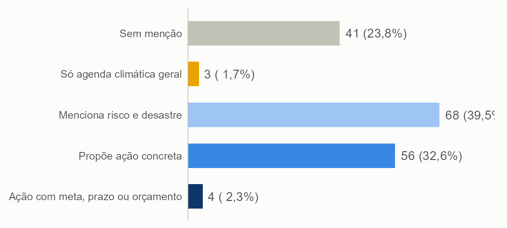
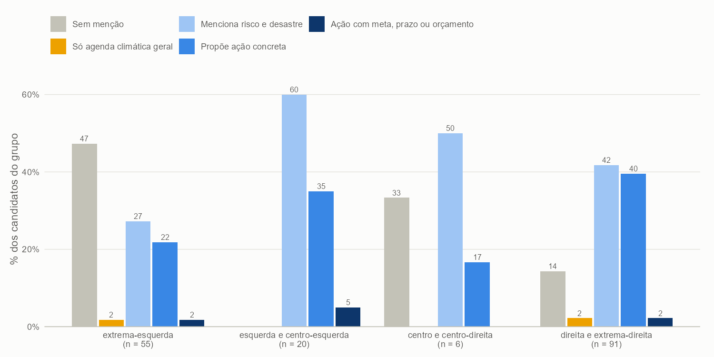
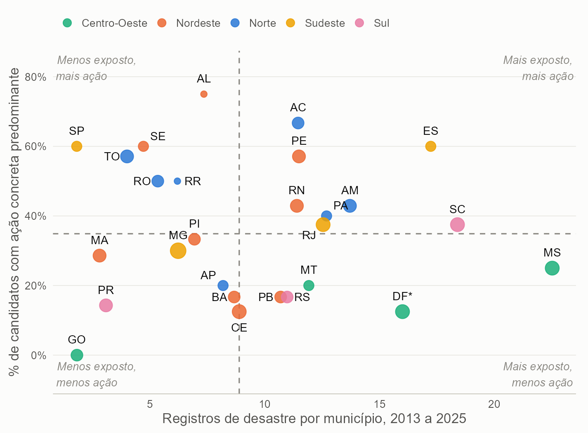

Doutor em Ciência Política pela Universidade Federal de Pernambuco (UFPE, 2025). Pesquisador de pós-doutorado no Centro de Estudos da Metrópole (CEM/USP), com apoio da Fapesp. Pesquisador colaborador no Instituto de Pesquisa Econômica Aplicada (Ipea) e pesquisador no Instituto Nacional de Ciência e Tecnologia QualiGov (INCT QualiGov).

O presente relatório foi conduzido de forma independente pelo autor, com o objetivo de investigar a seguinte pergunta de pesquisa: *o que os candidatos a governador dizem, e deixam de dizer, sobre risco e desastre em seus planos de governo, e como isso varia entre regiões, estados, partidos e campos políticos?*

A hipótese que orienta a leitura dos resultados é que o tratamento do tema nos planos de governo não é uniforme, e que essa variação se explica menos pela geografia do risco — a exposição real de cada estado a desastres — e mais por fatores do próprio documento e de quem o escreve: a extensão do plano, o campo político do candidato e a natureza do cargo em disputa. A investigação trata risco e desastre como um objeto que pode ser dito de formas muito diferentes, da menção genérica ao compromisso com meta, prazo, indicador ou orçamento, e propõe uma escala de concretude para captar essa distinção. A pesquisa parte da literatura sobre desastres, federalismo e comportamento eleitoral, e mobiliza dados do TSE e do Atlas Digital de Desastres, com classificação de texto assistida por modelos de linguagem executados localmente, por meio do pacote **acR**, desenvolvido pelo autor.

O relatório completo, com o código, os dados derivados e o codebook, está em repositório aberto: [github.com/andersonheri/planos-governo-risco-desastre-2026](https://github.com/andersonheri/planos-governo-risco-desastre-2026).

## Dimensões conceituais e revisão da literatura

O relatório parte de três razões para tratar risco e desastre como objeto de pesquisa nos planos de governo estaduais. A primeira é conceitual: a literatura sobre desastres (Quarantelli, 1998; Wisner et al., 2004; Kelman, 2020) entende que o desastre não é o evento físico em si, mas o resultado de um evento perigoso que encontra populações expostas e vulneráveis, e que a vulnerabilidade tem história, distribuição social e território (Cutter, 1996; 2011). O glossário do Escritório das Nações Unidas para Redução do Risco de Desastres (UNDRR) e o Marco de Sendai traduzem essa visão em uma agenda que vai do entendimento do risco à preparação e à reconstrução, e no Brasil essa perspectiva foi desenvolvida sobretudo pela sociologia dos desastres (Valencio, 2009; Marchezini et al., 2017).

A segunda razão é política: há evidência de que os eleitores premiam o alívio depois do desastre mais do que o investimento em prevenção (Healy e Malhotra, 2009), de que o desastre funciona como evento focalizador que abre janelas para mudança de política (Birkland, 1998; 2006), e de que a distribuição de declarações e de recursos de emergência responde a incentivos eleitorais e partidários (Reeves, 2011; Henrique e Batista, 2020). Uma explicação alternativa, e complementar, está na divisão federativa de competências: a Lei 12.608/2012 atribui ao estado sobretudo a coordenação territorial, o mapeamento de áreas de risco e as obras estruturais, enquanto resposta imediata e reconstrução recaem em boa parte sobre municípios e União — o que tornaria a ênfase em prevenção reflexo também do papel constitucional do governador, e não só de escolha discursiva.

Essa base conceitual orientou a escolha das dimensões do codebook — relevância, fase do ciclo de gestão de risco, tipo de ameaça, especificidade e ancoragem — e a decisão de tratar agenda climática geral e risco de desastre como categorias distintas, ainda que relacionadas.

## Construção do codebook e classificação dos planos

A unidade de análise é a *janela*: a frase que contém um termo de um dicionário de risco e desastre, mais a frase anterior e a seguinte, com a frase focal marcada para o modelo. O codebook (versão 0.9) define cinco dimensões. A **relevância** separa o que trata de risco e desastre do que trata de agenda climática geral ou de outro assunto, por uma regra de decisão em ordem. A **fase do ciclo** marca prevenção e preparação (uma só categoria), resposta, recuperação e adaptação climática explícita, com uma regra específica para benefício habitacional — moradia temporária conta como resposta, e aluguel social com horizonte de transição, moradia definitiva e reconstrução contam como recuperação. O **tipo de ameaça** cobre nove categorias, de enchente a acidentes tecnológicos, mais "desastres em geral" para menções sem tipo nomeado. A **especificidade** mede o grau de concretude em uma escala de 0 a 4, do slogan à ação com meta, prazo, indicador ou orçamento. A **ancoragem** identifica, por regras textuais, os elementos que permitem cobrar uma promessa — órgão, orçamento, meta, prazo e indicador.

A classificação foi feita por dois modelos de linguagem de código aberto executados localmente (`gpt-oss-20b` e `gemma-4-26b`), sem envio de texto a serviços externos, com o pacote acR. As passagens de nível 4 — as que sustentam o degrau mais alto do perfil do candidato — foram revisadas manualmente, uma a uma, para separar proposta de balanço e de crítica ao governo em exercício.

## Metodologia

O universo são os candidatos a governador com candidatura deferida e plano de governo registrado no Portal de Dados Abertos do TSE (coleta congelada em 23/09/2026), num total de 172 candidatos. Os dados de exposição a desastres vêm do Atlas Digital de Desastres no Brasil (MIDR/S2iD, registros de 2013 a 2025). Como os dois modelos podem discordar em casos de fronteira, os resultados são apresentados em três cenários — principal (`gpt-oss`), conservador (o que os dois modelos concordam ser relevante) e amplo (o que ao menos um considera) —, e a concordância entre modelos é medida pelo alfa de Krippendorff e reportada por variável. A extensão do plano é tratada como variável de confusão: comparações entre campos políticos e categorias usam controle por `log(palavras)` em regressão logística, e um limiar de 2.000 palavras, testado por sensibilidade, sinaliza planos curtos.

## Resultados e Discussão

**Quase todos citam o tema, poucos o tornam verificável.** Dos 172 candidatos, 128 (74,4%) mencionam risco ou desastre em algum ponto do plano, mas só 60 (34,9%) têm ação concreta em metade ou mais das passagens sobre o tema, e apenas 4 associam essa ação a meta, prazo, indicador ou orçamento. Entre os elementos que permitem cobrar uma promessa, o órgão responsável é o mais citado (71,9% dos que mencionam o tema), seguido de indicador (49,2%); prazo (27,3%), meta quantificada (18,8%) e valor em reais (15,6%) são bem mais raros. Só três candidatos — Tarcísio (Republicanos-SP), Carlos Machado (PCB-SP) e Ben Mendes (Missão-MG) — trazem valor em reais associado a uma promessa específica de risco e desastre.

{#fig-perfil width=95%}

**Os planos olham para antes do desastre.** Prevenção e preparação aparecem em 71,5% dos candidatos, contra 34,9% de resposta e 24,4% de recuperação, e só 27 candidatos (15,7%) cobrem as três fases do ciclo. O padrão contraria a expectativa, derivada da literatura sobre voto e desastre, de que o incentivo eleitoral favoreceria o discurso sobre o socorro e a reconstrução — uma leitura possível é que o plano de governo é um documento programático e não uma peça de campanha de rua, e que a divisão federativa de competências atribui ao estado sobretudo a coordenação preventiva.

**A presença do tema depende do tamanho do plano, e em parte do campo político.** A presença vai de 35% nos planos com menos de 5 mil palavras a 100% nos de mais de 20 mil. Na extrema-esquerda, 51% dos candidatos mencionam o tema, contra 82% na direita, 91% na extrema-direita e 100% na esquerda e centro-esquerda. Controlando pelo tamanho do plano por regressão logística, a diferença da extrema-esquerda para a direita diminui (razão de chances de 0,78 sem controle para 0,30 com controle) mas não desaparece, e é heterogênea entre os partidos da categoria — PSTU e PSOL estão no patamar da direita, enquanto PCO, UP e PCB puxam a média para baixo. Na concretude, não se detecta diferença entre campos: o que varia é **se** o tema aparece, não **como** ele é tratado quando aparece.

{#fig-campo width=95%}

**O plano não acompanha o desastre que o estado sofre.** Em média, 54% dos candidatos citam o principal tipo de desastre do seu estado, e em 10 das 27 UFs a metade ou menos o faz; 79 dos 172 candidatos não citam o principal tipo de desastre do próprio estado. Cruzando a intensidade dos desastres de cada estado (registros por município) com a concretude dos planos, a correlação de Spearman é de -0,02 (p = 0,935), praticamente nula — conhecer a exposição de um estado quase não ajuda a prever a concretude dos seus planos. Estados com muitos registros por município, como MS, SC e ES, têm proporções de ação concreta muito diferentes entre si (25%, 38% e 60%), e o mesmo vale para estados com poucos registros.

{#fig-exposicao width=95%}

## Considerações Finais

O relatório documenta, para 172 candidatos e 172 planos, o que se diz e o que se deixa de dizer sobre risco e desastre antes da eleição, com casos e trechos nominais que permitem ao leitor conferir a leitura — um retrato nacional que serve de linha de base para comparar, depois da posse, o que foi prometido e o que foi feito. A distinção entre falar e prometer, sustentada pela escala de concretude e pelos elementos de ancoragem, mostra que separar proposta, balanço e crítica é uma tarefa que falta entrar nos codebooks de planos de governo. E o método — leitura por modelos de código aberto executados localmente, com medida explícita de confiabilidade e código e dados abertos — é replicável para outros corpora e outras eleições.

A classificação não foi validada por codificação humana, e a confiabilidade medida é a de consistência entre dois modelos, não de acerto; ela é boa para os tipos de ameaça específicos e aceitável para a relevância, mas fraca para a especificidade, e por isso o relatório apresenta faixas, e não números exatos, para o degrau de ação concreta. A ancoragem por regras textuais não foi validada contra leitura manual, e uma categoria do codebook (erosão costeira e fluvial) mostrou ruído de classificação que está documentado no relatório. A comparação entre campos políticos e a leitura por UF devem ser lidas com cautela: cada estado tem de 4 a 10 candidatos, e um único plano muda o percentual em 10 a 25 pontos.

## Recomendações e próximos passos

Três passos ampliariam a confiança e o alcance dos resultados. O primeiro é uma validação humana, em amostra de passagens, para medir o acerto da classificação e não só a sua consistência, incluindo a validação das regras de ancoragem contra uma amostra codificada manualmente. O segundo é a codificação explícita de proposta, balanço e crítica como dimensão própria do codebook, o que resolveria a maior limitação identificada nos resultados. O terceiro é a comparação, depois da posse, entre o que foi prometido nos planos e o que o governo de fato executou em prevenção, preparação e resposta — o teste mais direto da hipótese de que falar não é o mesmo que prometer, e prometer não é o mesmo que fazer.

Para quem usa este relatório como insumo — pesquisadores, jornalistas, sociedade civil —, a recomendação central é ler os percentuais de presença do tema como um piso generoso, e os de ação concreta como a medida mais informativa sobre o que cada candidato de fato se compromete a fazer diante de risco e desastre.

O código, o codebook e os dados derivados estão em repositório aberto: [github.com/andersonheri/planos-governo-risco-desastre-2026](https://github.com/andersonheri/planos-governo-risco-desastre-2026).
